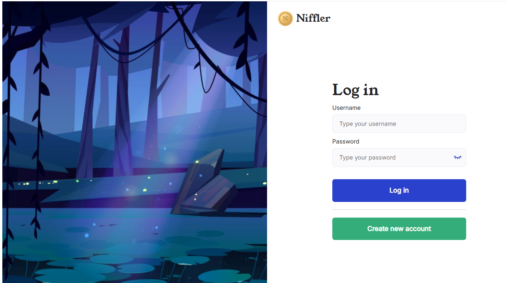
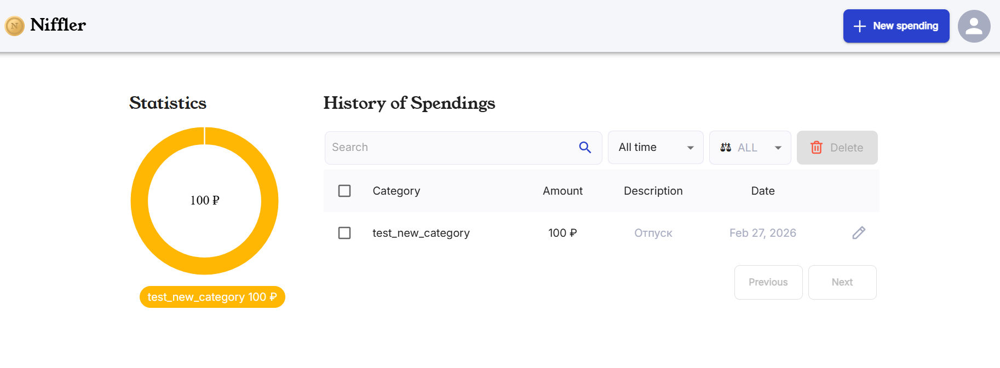
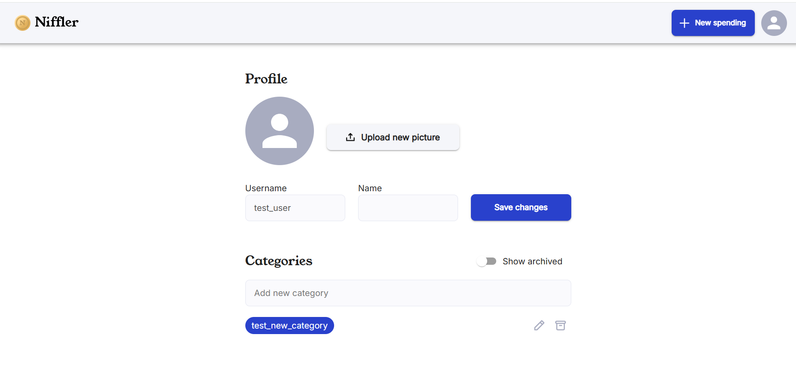
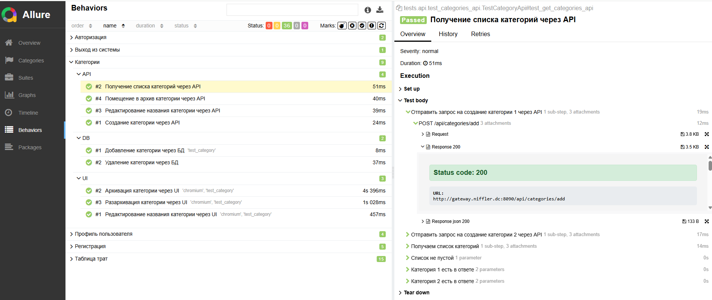

# Проект по автоматизации тестирования приложения по учету трат Niffler в рамках [курса по автоматизации](https://qa.guru/python-advanced)

## Окно авторизации Niffler



## Таблица трат



## Профиль пользователя



## Технологии и инструменты

<table>
  <tr>
    <td align="center">
      <br>
      <b>Python</b>
    </td>
    <td align="center">
      <br>
      <b>Playwright</b>
    </td>
    <td align="center">
      <br>
      <b>Pytest</b>
    </td>
    <td align="center">
      <br>
      <b>Requests</b>
    </td>
    <td align="center">
      <br>
      <b>Allure</b>
    </td>
  </tr>
  <tr>
    <td align="center">
      <br>
      <b>GitHub</b>
    </td>
    <td align="center">
      <br>
      <b>Docker</b>
    </td>
    <td align="center">
      <br>
      <b>PostgreSQL</b>
    </td>
    <td align="center">
      <br>
      <b>Kafka</b>
    </td>
    <td align="center">
      <br>
      <b>SOAP</b>
    </td>
  </tr>
</table>

> В проекте написаны End-to-end тесты для микросервисного приложения Niffler.
> 
> Фреймворк проверяет полный цикл работы приложения, взаимодействуя с его <code><strong>*UI, REST API, SOAP API и Kafka*</strong></code>.
> 
> UI автотесты аписаны на <code><strong>*Python*</strong></code> с использованием <code><strong>*Playwright, Pytest, Pydantic*</strong></code>.
>
>Запуск тестов выполняется локально с использованием <code><strong>*Docker*</strong></code>, непрерывная интеграция реализована с <code><strong>*GitHub Actions*</strong></code>
>
>Тесты запускаются параллельно в несколько потоков при помощи <code><strong>*pytest-xdist*</strong></code>
>
><code><strong>*Allure Report*</strong></code> используется для визуализации результатов тестирования.

## Реализованые проверки

>- [x] *API-тесты на микросервис niffler-spend*
>- [x] *Kafka-тесты на регистрацию пользователей*
>- [x] *SOAP-тесты микросервиса niffler-userdata на данные о пользователях*
>- [x] *UI- тесты на основные пользовательские пути (Авторизация, Добавление трат и тд)*
>- [x] *Подготовка к некоторым тестам ведется через БД postgres c спользованием библиотеки SQLAlchemy*


## Запуск тестов локально

### Запуск приложения
- Предварительно понадобится установить Docker
- Все команды выполняются в Git Bash
- Также понадобится скачать Java 21
```
git clone https://github.com/Ryabtsev-Kirill-QA/niffler-py-st3

#    Для Windows может потребоваться исправить форматы файлов из postgres/script
sed -i -e 's/\r$//' postgres/script/init-database.sh
chmod +x postgres/script/init-database.sh
bash localenv.sh
```
```
cd niffler-py-st3
```
- запускаем контейнеры
```
./docker-compose-dev.sh
```
```
cd niffler-e-2-e-tests-python
```
```
cp .env.example .env
# Отредактируйте .env, указав креды
```
- Устанавливаем зависимости через Poetry
```
poetry install
```
Устанавливаем браузеры для Playwright
```
poetry run playwright install
```
### Запуск всех тестов
- последовательно:
```
poetry run pytest --alluredir=allure-results --clean-alluredir
```
- параллельно в 2 потока:
```
poetry run pytest -n 2 --dist loadgroup --alluredir=allure-results --clean-alluredir
```
### Генерация и просмотр отчета Allure
```
allure serve allure-results
```


## GitHub Actions CI/CD

Проект использует GitHub Actions для автоматического запуска тестов при изменениях в репозитории.

Триггеры запуска:

- pull_request в ветку main
- новые коммиты в пулл реквесте
- ручной запуск через интерфейс GitHub

С итоговым отчетом после прогона можно ознакомиться: https://ryabtsev-kirill-qa.github.io/niffler-py-st3/

[](https://github.com/Ryabtsev-Kirill-QA/niffler-py-st3/actions/workflows/python-tests.yml)